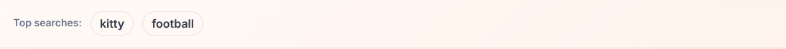
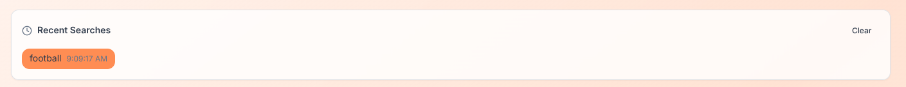

# Image Search Application

This is a full-stack image search application with OAuth integration and Unsplash API integration.

## Table of Contents

- [Features](#features)
- [Setup](#setup)
  - [Prerequisites](#prerequisites)
  - [Environment Variables](#environment-variables)
  - [Installation](#installation)
- [Folder Structure](#folder-structure)
- [API Endpoints](#api-endpoints)
- [Visual Proof](#visual-proof)

## Features

-   **User Authentication:** Secure login via Google, GitHub, and Facebook OAuth.
-   **Image Search:** Search for high-resolution images using the Unsplash API.
-   **Guest Access with Verification Game:** Guests can access after completing a simple verification game.
-   **Top Searches:** View a dynamic list of the most frequently searched terms across all users.
-   **Personal Search History:** Authenticated users can view and clear their past search queries.
-   **Responsive Design:** Optimized user experience across various devices (desktop, tablet, mobile).
-   **Dockerization:** Containerized client and server applications for easy setup, deployment, and scalability using Docker and Docker Compose.

## Setup

### Prerequisites

- Node.js (for client-side)
- Go (for server-side)
- MongoDB (for database)
- Docker (optional, for containerized deployment)

### Environment Variables

**Server-side (`.env` in root directory):**

Create a `.env` file in the root directory of the project with the following variables:

```
# Google OAuth
GOOGLE_CLIENT_ID="YOUR_GOOGLE_CLIENT_ID"
GOOGLE_CLIENT_SECRET="YOUR_GOOGLE_CLIENT_SECRET"

# GitHub OAuth
GITHUB_CLIENT_ID="YOUR_GITHUB_CLIENT_ID"
GITHUB_CLIENT_SECRET="YOUR_GITHUB_CLIENT_SECRET"

# Facebook OAuth
FACEBOOK_CLIENT_ID="YOUR_FACEBOOK_CLIENT_ID"
FACEBOOK_CLIENT_SECRET="YOUR_FACEBOOK_CLIENT_SECRET"

# Unsplash API
UNSPLASH_ACCESS_KEY="YOUR_UNSPLASH_ACCESS_KEY"

# MongoDB URI
MONGODB_URI="YOUR_MONGODB_CONNECTION_STRING"
```

**Client-side (`client/.env`):**

Create a `.env` file inside the `client/` directory with the following variable:

```
VITE_SERVER_URL="http://localhost:8080"
```

This variable is used by the Vite development server to know where the backend API is running.

### Installation

1.  **Clone the repository:**

    ```bash
    git clone <repository_url>
    cd image_search
    ```

2.  **Install client dependencies:**

    ```bash
    cd client
    npm install
    cd ..
    ```

3.  **Run the client:**

    ```bash
    cd client
    npm run dev
    cd ..
    ```

4.  **Run the server:**

    ```bash
    cd server
    go mod tidy
    go run main.go
    cd ..
    ```

5.  **Dockerized Installation (Recommended for production/easy setup):**

    Ensure you have Docker and Docker Compose installed.

    1.  **Clone the repository:**

        ```bash
        git clone <repository_url>
        cd image_search
        ```

    2.  **Build and run containers:**

        ```bash
        docker-compose up --build
        ```

    This command will build the Docker images for both the client and server, and then start all services defined in `docker-compose.yml`, including the MongoDB database.

## Folder Structure

```
image_search/
├── .env
├── .gitignore
├── docker-compose.yml
├── README.md
├── client/
│   ├── .env
│   ├── Dockerfile
│   ├── public/
│   ├── src/
│   │   ├── components/             # React components (e.g., SearchBar, ImageGrid)
│   │   ├── game/                   # Game assets
│   │   ├── hooks/                  # Custom React hooks
│   │   ├── lib/                    # Utility functions
│   │   └── pages/                  # Page components (e.g., Auth, Index)
│   ├── package.json                # Client-side dependencies and scripts
│   └── ... (other client files)
└── server/
    ├── Dockerfile
    ├── go.mod
    ├── go.sum
    ├── main.go
    ├── README.md
    ├── database/
    │   └── db.go
    └── datatypes/
        └── types.go
```

## Dockerization

This project includes `Dockerfile`s for both the client and server applications, allowing for containerized deployment using Docker.

-   **`client/Dockerfile`**: This Dockerfile is used to build a Docker image for the React frontend application. It sets up the Node.js environment, installs dependencies, builds the client application, and serves it using a web server (e.g., Nginx or a simple static file server).

-   **`server/Dockerfile`**: This Dockerfile is used to build a Docker image for the Go backend application. It sets up the Go environment, builds the Go executable, and runs the server application.

The `docker-compose.yml` file in the root directory orchestrates the build and deployment of both the client and server containers, along with a MongoDB service, for easy local development and deployment.

## API Endpoints

Here are the main API endpoints provided by the server:

### Authentication

-   **GET `/api/auth/:provider`**
    Initiates the OAuth flow for the specified provider (e.g., `google`, `github`, `facebook`).
    ```bash
    # Example for Google OAuth
    curl -v http://localhost:8080/api/auth/google
    ```

-   **GET `/api/auth/:provider/callback`**
    Callback URL for OAuth providers. Users are redirected here after successful authentication.
    (This endpoint is handled internally by the OAuth flow and usually not called directly).

-   **GET `/api/logout`**
    Logs out the currently authenticated user.
    ```bash
    curl -v http://localhost:8080/api/logout
    ```

### Image Search

-   **GET `/api/search-guest`**
    Searches for random images for unauthenticated users.
    ```bash
    curl "http://localhost:8080/api/search-guest?page=1"
    ```

-   **GET `/api/search`**
    Searches for images based on a `term` for authenticated users. Records the search term in history.
    Requires authentication.
    ```bash
    curl --cookie "your_session_cookie" "http://localhost:8080/api/search?term=nature&page=1"
    ```

-   **GET `/api/top-searches`**
    Retrieves a list of the most frequently searched terms across all users.
    ```bash
    curl http://localhost:8080/api/top-searches
    ```

### Search History

-   **GET `/api/history`**
    Retrieves the search history for the authenticated user.
    Requires authentication.
    ```bash
    curl --cookie "your_session_cookie" http://localhost:8080/api/history
    ```

-   **POST `/api/history/clear`**
    Clears the search history for the authenticated user.
    Requires authentication.
    ```bash
    curl -X POST --cookie "your_session_cookie" http://localhost:8080/api/history/clear
    ```

## Visual Proof

(Screenshots/GIFs demonstrating the application's functionality will be placed here.)

-   **OAuth Login:**

-   **Top Searches Banner:** 

-   **Search Results + Multi-select:** 

-   **Search History Section:**

